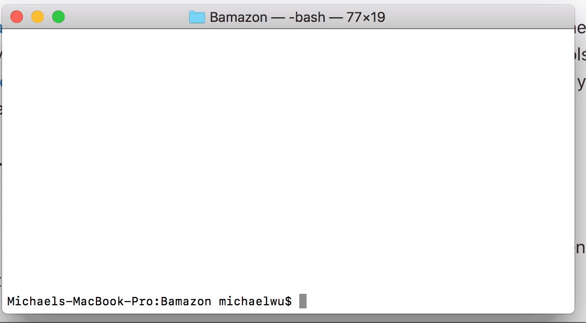

# Bamazon
## What is it?
Bamazon is a CLI app that creates a mockup store in your console. Buy goods or Add goods to your heart's content!

## How to install/begin
To install, you need the two following packages:
-mysql 
-inquirer

Run `npm install mysql` and `npm install inqurier` to begin.

Next, open up MySQL workbench and run bamazon.sql

Start the code by running `node bamazonCustome.js` or `node bamazonManager.js` 

## Gif Demonstration:

## Built with:
-Javascript
-SQL
-Inquirer

## Authors:
Michael Wu

